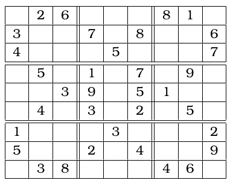

# SAT Sudoku Solver

A **SAT-based Sudoku solver** that uses constraint satisfaction techniques to solve Sudoku puzzles.
It takes a Sudoku puzzle as input, encodes it as a SAT problem, and uses a SAT solver to find a solution (or determine that none exists).

## 🛠️ Install Dependencies

This project requires the following Dependencies:

- **[Z3](https://github.com/z3prover/z3)** – A high-performance SAT solver.
- **[CryptoMiniSat](https://github.com/msoos/cryptominisat)** – An advanced SAT solver.

### Option 1: Using Nix (Recommended)

If you use the **Nix package manager**, you can set up the environment with:

```bash
direnv allow
# or
nix develop
```

This will automatically install all dependencies.

### Option 2: Manual Installation

If you prefer not to use Nix, install the dependencies manually:

```bash
pip install z3-solver
```

[Install Cryptominisat](https://github.com/msoos/cryptominisat#compiling)

## 🎯 Usage

Run the solver with a Sudoku puzzle string as input:

```bash
python3 sudoku_v1.py "YOUR_SUDOKU_INPUT_STRING"
```

### Example

```bash
python3 sudoku_v1.py "#26###81#3##7#8##64###5###7#5#1#7#9###39#51###4#3#2#5#1###3###25##2#4##9#38###46#"
```

This input represents the following Sudoku grid (where `#` denotes an empty cell):

- Each **9-character segment** corresponds to a row.



### Notes

- The solver will **print the solution** if one exists.
- If no solution is possible, it will **return an error**.
- Ensure your input string is **exactly 81 characters long** (9x9 grid).
